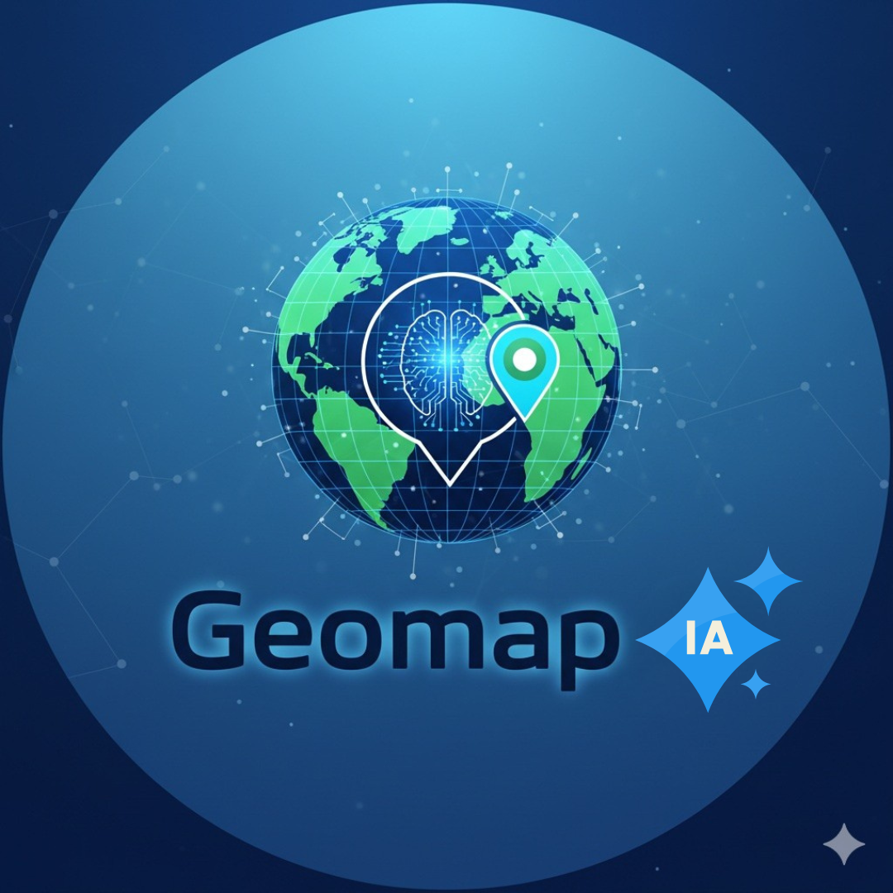

# Geomap IA



## Plateforme pédagogique ouverte pour la géomatique, la cartographie et l’environnement

**Geomap IA** est une plateforme pédagogique, scientifique et non lucrative dédiée au développement d’applications web légères pour la géomatique, la cartographie, la bioclimatologie, l’écologie et l’analyse environnementale.

Le projet vise à montrer que les outils ouverts, les technologies web accessibles et les solutions gratuites peuvent permettre de concevoir des applications utiles pour l’enseignement, la recherche, la formation et l’animation scientifique.

🌐 **Site officiel :**
https://geomapia.github.io/

---

## Objectif du projet

Geomap IA a pour objectif de mettre à disposition des étudiants, enseignants, chercheurs et utilisateurs de la géomatique des outils simples, accessibles et directement utilisables dans un navigateur web.

La plateforme permet de :

* créer et tester des applications web géomatiques ;
* produire des cartes de localisation ;
* manipuler des données spatiales ;
* analyser des données bioclimatiques ;
* valoriser les outils ouverts dans l’enseignement ;
* préparer des ateliers, tutoriels, clubs et hackathons autour de la géomatique.

---

## Applications disponibles

### Bioclimat & Écologie

Application pédagogique destinée à l’analyse bioclimatique et écologique.

Elle permet de travailler sur des données climatiques, de calculer des indices bioclimatiques et de produire des diagnostics utiles pour la biogéographie, l’écologie et l’environnement.

**Accès :**
https://geomapia.github.io/Applications/Bioclimat/

---

### Carte de Localisation 3.0 Gold

Application de cartographie web permettant de créer des cartes de localisation, d’importer des données spatiales, de gérer des couches cartographiques, de produire des encarts de zoom et de préparer des supports cartographiques.

**Accès :**
https://geomapia.github.io/Applications/Carte%20de%20localisation/

---

## Ressources de test

La plateforme propose des fichiers de démonstration pour tester les applications :

* données climatiques au format Excel ;
* ressources cartographiques ;
* fichiers GeoJSON ;
* fichiers Shapefile compressés ;
* images et fonds cartographiques.

**Page Ressources :**
https://geomapia.github.io/ressources.html

---

## Organisation du dépôt

```text
/
├── index.html
├── applications.html
├── ressources.html
├── about.html
├── contact.html
├── 404.html
├── sitemap.xml
├── robots.txt
├── IA.png
├── ma-photo.jpg
├── README.md
├── LICENSE
├── NOTICE.md
└── Applications/
    ├── Bioclimat/
    └── Carte de localisation/
```

---

## Technologies utilisées

Geomap IA repose sur des technologies web simples et ouvertes :

* HTML ;
* CSS ;
* JavaScript ;
* Leaflet ;
* GitHub ;
* GitHub Pages ;
* Formspree ;
* Google Analytics ;
* Google Search Console.

---

## Philosophie du projet

Geomap IA est volontairement hébergé sur **GitHub Pages** afin de valoriser :

* les outils ouverts ;
* l’accessibilité numérique ;
* la reproductibilité ;
* les solutions web légères ;
* les usages éducatifs, scientifiques et non lucratifs.

Le projet ne cherche pas à concurrencer les logiciels SIG professionnels. Il constitue plutôt un support pédagogique permettant d’apprendre la géomatique en construisant, testant et partageant des outils simples.

---

## Projet pédagogique

Geomap IA peut être utilisé comme support pour :

* des cours de cartographie ;
* des travaux dirigés de SIG ;
* des ateliers de géomatique web ;
* des formations à GitHub Pages ;
* des projets étudiants ;
* un club de géomatique ;
* un hackathon pédagogique ;
* des activités de vulgarisation scientifique.

---

## Perspectives

Les prochaines évolutions prévues sont :

* ajout d’une page Tutoriels ;
* intégration de vidéos explicatives ;
* création d’une page Club Geomap IA ;
* préparation d’un hackathon CartoHack Geomap IA ;
* ajout de nouvelles applications géomatiques ;
* amélioration progressive de la documentation ;
* publication de guides pédagogiques.

---

## Auteur

**Pr. Brahim Jaziri**
Géographe, enseignant-chercheur et spécialiste des approches géomatiques, cartographiques, biogéographiques et environnementales.

Site personnel :
https://brahimjaziri.jimdofree.com/

ORCID :
https://orcid.org/0000-0003-1920-396X

LinkedIn :
https://www.linkedin.com/in/brahim-jaziri-45082561/

---

## Citation recommandée

Toute réutilisation, adaptation ou mention du projet doit citer :

```text
Geomap IA — Pr. Brahim Jaziri
Plateforme pédagogique ouverte pour la géomatique, la cartographie et l’environnement
https://geomapia.github.io/
```

---

## Licence

Le projet Geomap IA est diffusé dans un cadre pédagogique, scientifique et non lucratif.

* Le **code source** est placé sous licence **GNU General Public License v3.0**.
* Les **textes, images, captures, ressources pédagogiques et supports de démonstration** sont placés sous licence **Creative Commons BY-NC-SA 4.0**, sauf mention contraire.

Cela signifie que la consultation, l’apprentissage, l’adaptation et la réutilisation pédagogique sont encouragés, à condition de citer la source et de respecter le cadre non commercial du projet.

---

## Contact

Pour toute remarque, suggestion, collaboration ou demande d’utilisation pédagogique :

📧 [geomapia.ia@gmail.com](mailto:geomapia.ia@gmail.com)
📧 [jaziribrahim@gmail.com](mailto:jaziribrahim@gmail.com)

---

## Slogan

**Geomap IA — Apprendre la géomatique en construisant des outils ouverts.**
